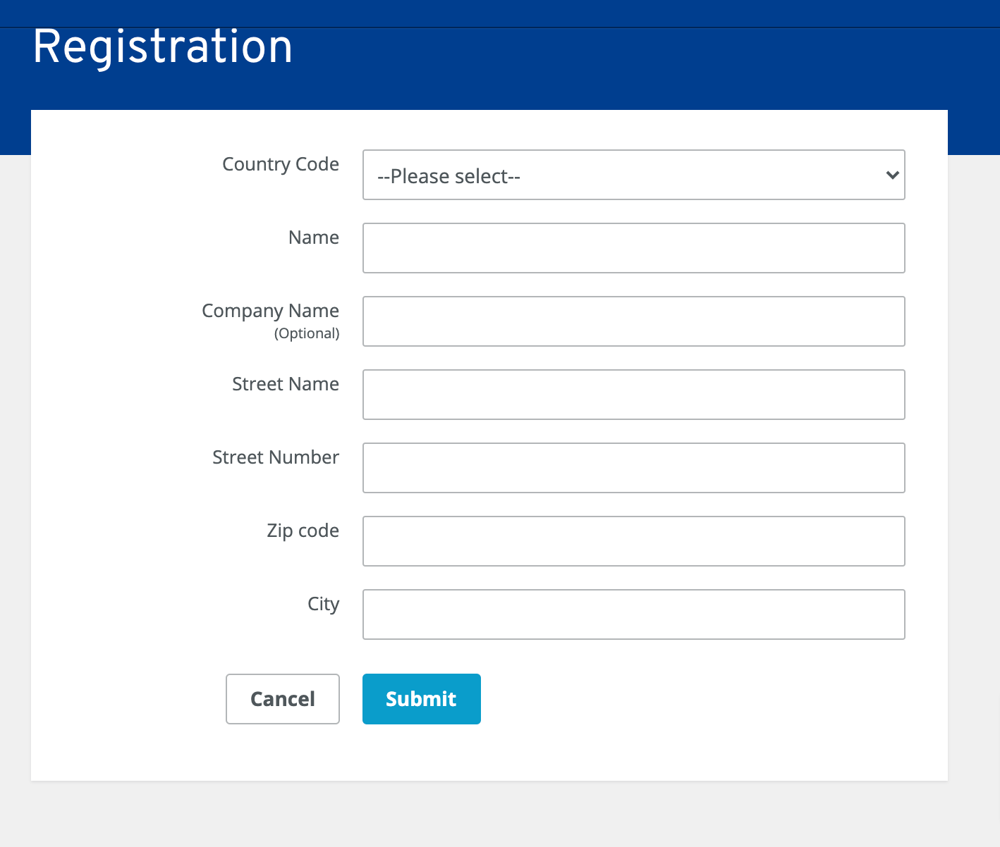

## How to Install
First, clone the repo:
```bash
$ git clone https://github.com/iamgurjitsingh/pilot.git
```

#### Install dependencies
```
$ cd pilot/src
$ composer install
```

#### Configure the Environment
Create `.env` file:
```
$ cat .env.example > .env
```
If you want you can edit database name, database username and database password.


Then create a database:
```bash
mysql> CREATE DATABASE pilot;
```

Change credentials in .env file:
```bash
DB_HOST=127.0.0.1
DB_PORT=3306
DB_DATABASE=homestead
DB_USERNAME=homestead
DB_PASSWORD=secret

AWS_ACCESS_KEY_ID=access_key
AWS_SECRET_ACCESS_KEY=secret_key
AWS_DEFAULT_REGION=default_region
AWS_BUCKET=bucket
AWS_URL=url
AWS_ENDPOINT=endpoint
```

Run the Artisan migrate command:
```bash
$ php artisan jwt:secret 
```

Run the Artisan migrate command:
```bash
$ php artisan migrate
```

Run Application:
```bash
$ php -S localhost:8000 -t public/
```
You can create a virtualhost as well. http://ionos.pilot.local:8000

## API Routes
| HTTP Method	| Path | Action |  Desciption  |
| ----- | ----- | ----- | ------------- |
| GET      | /api/registrations | index |  Get all registrations
| POST     | /api/store | store |  Create an registration
| GET      | /api/registration/{id} | show |  Fetch an registration by id
| PUT      | /api/registration/{id} | update | Update an registration by id
| DELETE      | /api/registration/{id} | destroy | Delete an registration by id

## How to test it. 
```bash
1) Use below URL to see how customer will submit registrations 
https://localhost:8000/

2) Use below URL to see the full list of registrations and add/edit/delete feature.
   https://localhost:8000/demo/list

3) The CSV export is schedule to run after every 3 hours. You need to setup crontab.

$ crontab -e
$ * * * * * cd /path-to-your-project && php artisan schedule:run >> /dev/null 2>&1

4) You can adjust timing for CSV export in app/Console/Commands/Kernel.php

$schedule->command('export:register')->cron('0 */3 * * *');
```

Command to export CSV of registration:
```bash
$ php artisan export:register
```

| Customer Registration      
|----------------------
| 